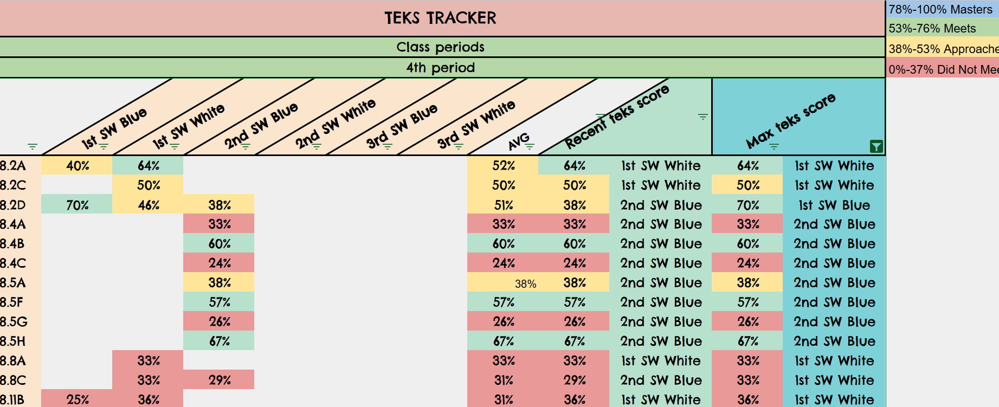

# TEKS_Tracker
Math Texas Essential Knowledge and Skill Tracker 
TEKS Tracker
This project is a Google Sheets-based tool that tracks the performance of 8th-grade math students according to the Texas Essential Knowledge and Skills (TEKS) standards. The tracker helps monitor class averages, visualize trends, and identify areas where students may need additional support. It is designed to provide teachers, students, and parents with insight into academic progress throughout the school year.

Purpose
The TEKS Tracker serves as an ongoing progress-monitoring tool that aggregates class data and allows for easy updates as new assessments are conducted. It includes dynamic data linking between sheets, conditional formatting for quick interpretation, and multiple visualizations to track student performance over time.

Data Organization

Input Data:

TEKS averages are manually input into a master table that categorizes data by TEKS standard, class period, and test name.
As the school year progresses, this table is updated with averages for newly tested TEKS standards.

Data Linking Across Sheets:

Each class period has its own sheet, which is linked to the master table using the following formula:

=IFERROR(INDEX(Sheet4!$C$11:$H$99, MATCH(1, (Sheet4!$A$11:$A$99 = $A7) * (Sheet4!$B$11:$B$99 = "1st Period"), 0), MATCH(G$5, Sheet4!$C$11:$H$11, 0)),""). 

The linking formula used (=IFERROR(INDEX(...))) pulls data from the master table to each class sheet, based on the period and TEKS standard. This dynamic formula keeps each class’s data current without requiring manual input.

Rows are Organized by TEKS standards.
Columns are Labeled as test names, averages, maximum score, and recent score.
The sheet can be filtered to show only the TEKS that have been tested.

Conditional Formatting:

Data is color-coded based on performance thresholds:
Red: < 37% signals immediate reteaching,
Yellow: < 53% indicates areas needing reinforcement,
Green: < 76% shows satisfactory performance,
Blue: < 100% represents mastery.

Data Analysis and Visualizations

To track student progress and performance trends, several types of charts and graphs are used:

  Line Chart:
  Visualizes the performance of each TEKS standard over time.
  X-axis: Test names (e.g., “1st Blue Assessment”).
  Y-axis: Averages of each TEKS, represented by different lines.

  Bar Chart:
  Compares the most recent score for each TEKS with its maximum score. The maximum score metric provides a benchmark for each TEKS standard, repesenting the highest achievement level reached to date. The recent score reflects the latest student prfommance, offering a snapshot of current understanding. By comparing these two scores, teachers can identify retention of knowledge over time and determine whether recent intervetions or instructional adjustments are effective. 
  Data is extracted using these formulas:

Most Recent Score:
  =ArrayFormula(IFERROR(LOOKUP(2, 1/(TRIM(B7:G7)<>"") , B7:G7), ""))
The Most Recent Score formula (=ArrayFormula(...)) identifies the most recent data point entered. It’s designed to locate the last non-empty cell, ensuring the score reflects the latest assessment

Maximum Score:
  =IF(MAX(B7:G7)>0, MAX(B7:G7),"")

Donut Chart: The donut chart provides a visual summary of performance on a specific TEKS (e.g., 8.8c). standard by comparing the 'Recent Score' to the 'Max Score.' The inner circle represents the highest score achieved (the potential), while the shaded area represents the most recent score, showing how close students are to meeting or exceeding prior benchmarks. By visually comparing these scores, the donut chart shows whether recent assessments match or fall short of past performance, allowing teachers to identify standards where knowledge retention is strong or where reteaching may be required.
Key Features

  Dynamic Data Updates: The tracker is continuously updated throughout the     year as new assessments are conducted and new TEKS are tested.
  Class Confidentiality: The system aggregates data by class period,           ensuring student privacy.
  Customized Visualizations: Teachers can use the visual tools to identify     trends and address learning gaps through reteaching, tutoring, or quick      assessments.

Future Improvements
As the tracker currently requires manual data input, it may not reflect real-time data. However, planned future integration with DMAC will address this limitation and improve data accuracy. Future improvements will introduce growth projections, which analyze trends in student performance over time. This will help teachers estimate likely future performance based on current data, assisting in proactive intervention planning.

